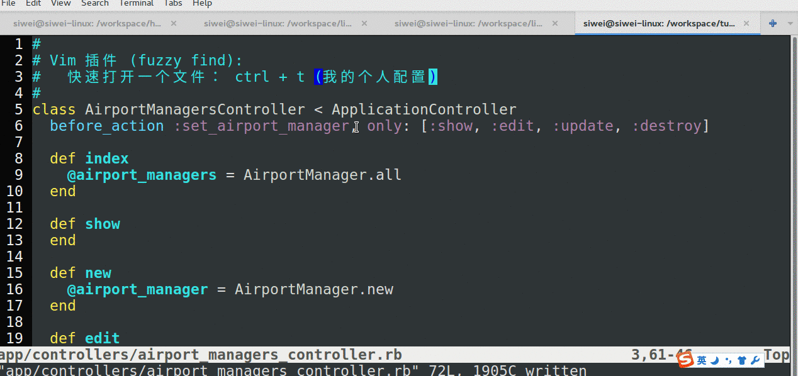
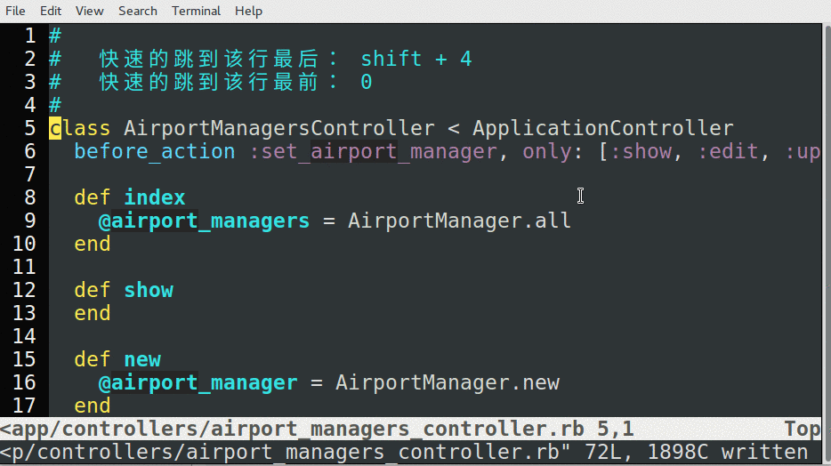
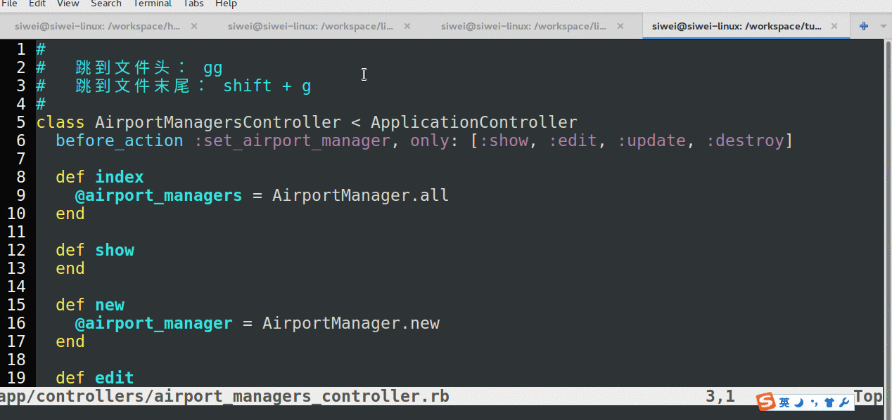
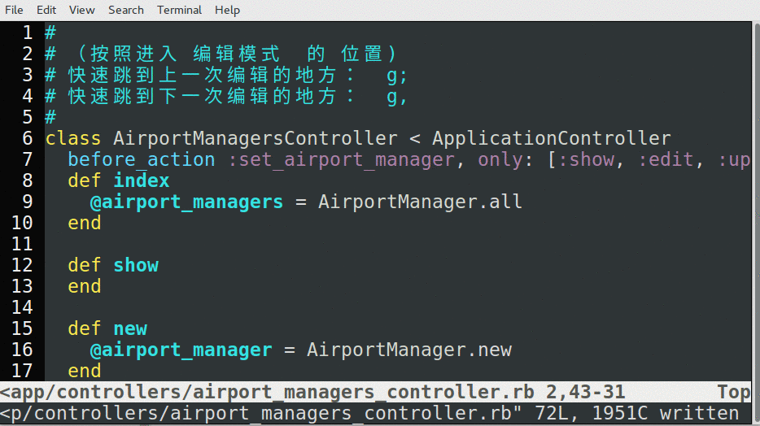
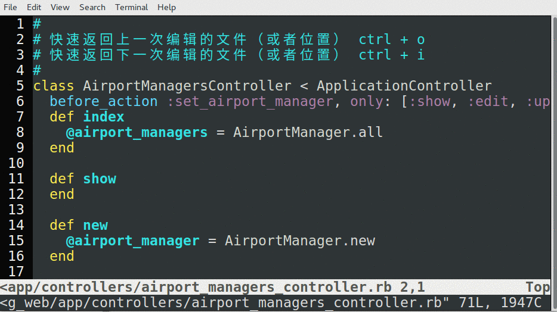
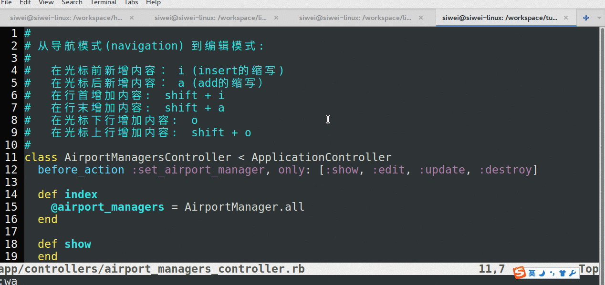
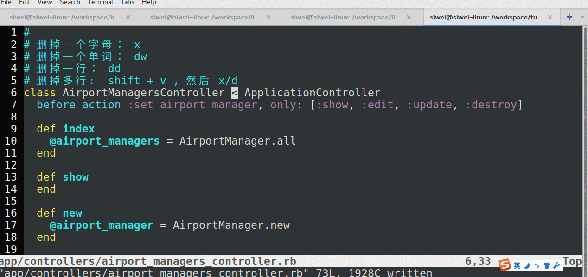
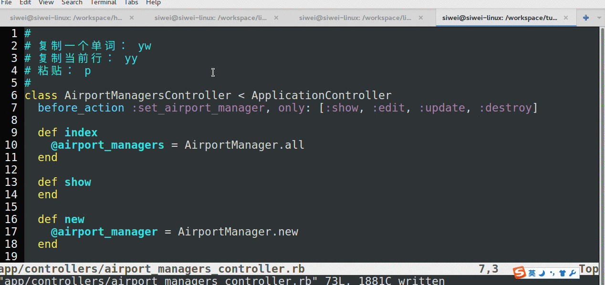

# 各种快捷导航功能

Vim 的精髓，在于不用鼠标，把很多鼠标的操作交给了键盘。

所以，一旦大家掌握了下面的操作，别人看你的屏幕时就会觉得眼花缭乱。

##  快速打开文件

使用的插件： fuzzy find

`ctrl + t`, 就会弹出  `>file>` 这样的标志，然后输入：`**/文件名` 即可。 文件名是模糊查询。

我输入 `ab`, vim 也会把 `aub` 的结果列出来。

注意：有些mac同学的vim里用不了这个功能，有兴趣的同学欢迎提交pull request来说明解决方案。

不过实际部署的时候不要紧。一般使用ctrl + e, 可以很好的弥补。

## 快速打开历史文件

使用的插件： MRU （most recently used files)

`ctrl + e` 即可。  （这个快捷键是我自己配的）

 

## 跳到行首， 行末

- 跳到当前行的末尾：  `shift + 4`  (意为  `$` , 这是正则表达式中 末尾的意思）
- 跳到当前行的行首：  `0`

## 快速跳到文件首行 ， 尾行。

“跳到尾行” 这个功能很多时候很有用。例如， vim 进入到文件夹后，最新的文件（特别是以日期命名的文件）往往排在最下面。`shift + g` 然后按回车可以直接打开。 想象不到吧～

- `gg`: 第一行
- `shift + g`: 末行。

 

## 快速跳到 上一次 / 下一次编辑的地方：

- 跳到 上一次编辑的地方：  `g;`
- 跳到 下一次编辑的地方：  `g,`

## 返回上一次/下一次编辑的文件或位置

- 快速返回上一次编辑的文件：  `ctrl + o`  ( o 意为 outer )
- 快速返回下一次编辑的文件：  `ctrl + i`   (  i 意为 inner )

# 输入模式

## 输入文本

从导航模式到编辑模式，有下面几种方法:

- 在光标前输入： `i` ( insert )
- 在光标后输入： `a` (append / after )
- 在行首增加内容：  `shift + i`
- 在行末增加内容：  `shift + a`
- 在光标下行增加内容：  `o`
- 在光标上行增加内容：  `shift + o` （这个操作往往会有500毫秒的延迟）

## 删除

以下删除都以当前光标作为起始位置。

- 删掉一个字母：`x`
- 删掉一个单词： `dw`
- 删掉一行： `dd`
- 删掉多行： `shift +v`, 然后 `x` 或者 `d`

## 复制与粘贴

复制，或者删除（vim认为删除就是剪切，所有被删掉的内容，都会被放到复制缓冲区中）后，就可以粘贴了。

- 复制一个单词：  `yw`
- 复制当前行：  `yy`
- 粘贴:  `p`

